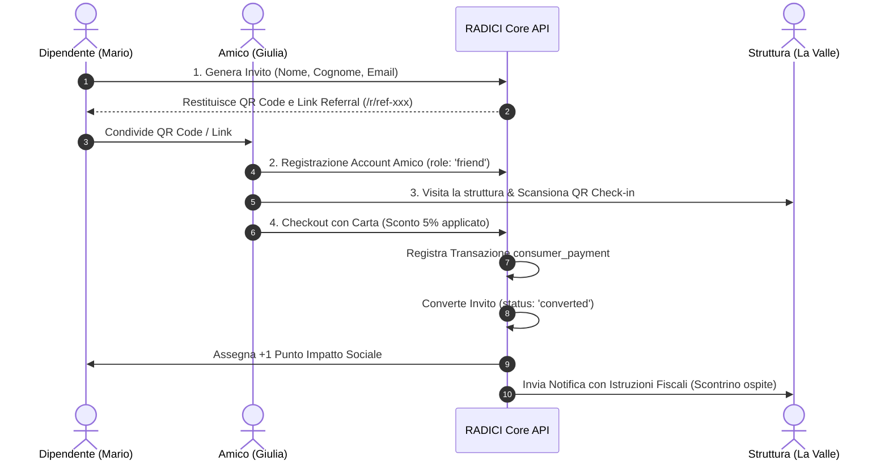
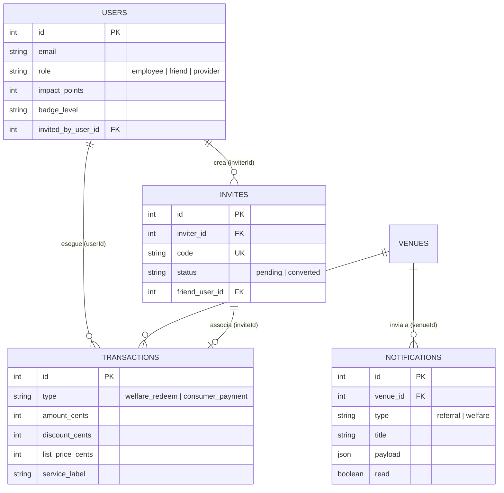

# Analisi e Verifica Tecnica: Meccanismo di Referral & Pagamenti RADICI

Documento di audit e validazione del flusso referral **"Invita un Amico / Pay-Local"** della piattaforma welfare territoriale **RADICI**.

---

## 1. Executive Summary

Il sistema di referral di RADICI implementa un modello a **doppio binario fiscale**:
1. **Binario Dipendente (Welfare Aziendale Art. 51 TUIR)**: L'utente dipendente riscatta voucher a importo prefissato (hotel, aperitivo, teatro) pre-finanziati dalla propria azienda, con azzeramento del buono e fatturazione diretta B2B alla società sponsor.
2. **Binario Amico / Consumer (Pay-Local Referral)**: L'ospite invitato **non consuma il plafond welfare aziendale**. Paga direttamente con la propria carta di credito, ottiene un **micro-sconto community del 5%** e, al completamento del saldo, il sistema premia il dipendente invitatore con **+1 Punto Impatto Sociale**, aggiornandone il livello di cittadinanza attiva (Badge).



---

## 2. Architettura e Separazione dei Cassetti Fiscali

| Caratteristica | Welfare Dipendente (Art. 51 TUIR) | Referral Amico (Pay-Local) |
| :--- | :--- | :--- |
| **Metodo di Pagamento** | Voucher prepagato aziendale | Carta di credito / debito dell'ospite |
| **Plafond Utilizzato** | Conto welfare aziendale sponsor | Fondi personali del consumatore |
| **Vantaggio per l'Ospite** | Servizio 100% coperto dal piano welfare | Micro-sconto community del 5% |
| **Trattamento Fiscale Struttura** | Fattura elettronica B2B intestata all'azienda sponsor | Normale scontrino / corrispettivo fiscale all'ospite |
| **Premialità Invitatore** | Generazione punti impatto al riscatto (+1 pt) | Assegnazione automatica di +1 Punto Impatto Sociale |

---

## 3. Flusso End-to-End Verificato

### Fase 1: Creazione dell'Invito (`POST /api/invites`)
- **Autenticazione**: Riservata agli utenti loggati (`role: 'employee'`).
- **Input**: `firstName`, `lastName`, `email`.
- **Elaborazione**: Generazione codice univoco `randomCode("ref")` (es. `ref-mt2zysim`).
- **Database**: Creazione record nella tabella `invites` con `status: 'pending'` e `inviterId = me.id`.

### Fase 2: Landing Page & Onboarding Amico (`/r/[code]` & `/registrati`)
- L'amico atterra su `http://localhost:3000/r/ref-xxx` dove visualizza:
  - Il nome dell'invitatore (*"Mario Rossi ti aspetta nei locali RADICI"*).
  - La spiegazione trasparente del meccanismo: nessun voucher aziendale consumato, pagamento autonomo con sconto, premio sociale all'amico.
  - Il pulsante per la creazione dell'account (`role: 'friend'`, con salvataggio di `invitedByUserId`).

### Fase 3: Check-in sul Posto (`/checkin/[code]`)
- L'ospite inquadra il QR code della struttura (es. `venue-la-valle`) o seleziona il servizio desiderato (Pernottamento, Aperitivo Degustazione, Spettacolo).
- Il componente `CheckinClient` rileva lo stato di autenticazione e la presenza del codice referral.

### Fase 4: Checkout e Applicazione Sconto (`POST /api/payments/checkout`)
- **Calcolo Tariffe**:
  $$\text{Prezzo Listino} = \text{servicePrice}(\text{venue}, \text{service})$$
  $$\text{Sconto (5\%)} = \text{Math.round}(\text{listPrice} \times 0.05)$$
  $$\text{Importo Pagato} = \text{listPrice} - \text{Sconto}$$
- **Registrazione Transazione**: Viene inserito un record in `transactions` con:
  - `type`: `'consumer_payment'`
  - `status`: `'receipted'`
  - `amountCents`: importo netto pagato
  - `discountCents`: sconto applicato
  - `listPriceCents`: prezzo pieno del listino

### Fase 5: Assegnazione Impatto & Notifica al Fornitore
1. **Conversione Invito**: Il record in `invites` passa da `'pending'` a `'converted'` con collegamento `friendUserId`.
2. **Accredito Punti**: Esecuzione della funzione `awardImpact(inviterId, 1)`:
   - Incremento di `impact_points` per l'invitatore.
   - Ricalcolo dinamico del badge di cittadinanza attiva (da *Esploratore* a *Custode del Territorio*, fino ad *Ambassador Locale*).
3. **Notifica Struttura**: Creazione di un record nella tabella `notifications` per il gestore della struttura con payload guidato:
   - Indicazione dell'importo incassato via carta.
   - Nota fiscale: *"Emettere normale scontrino/corrispettivo fiscale all'ospite"*.
   - Attribuzione dell'impatto: *"Assegnato +1 Punto Impatto a Mario Rossi"*.

---

## 4. Esito della Simulazione Eseguita

La simulazione end-to-end eseguita a livello di motore database e API ha restituito i seguenti risultati:

```text
[1. Stato Iniziale Invitatore]
Mario Rossi: 13 Punti Impatto | Badge: Ambassador Locale

[2. Creazione Invito]
Ospite: Giulia Moretti (giulia.moretti@test.it)
Codice Generato: ref-test-mt2zysim | Stato: pending

[3. Registrazione Ospite]
Utente ID: 9 | Ruolo: friend | Invitato da ID: 1

[4. Transazione Struttura - Agriturismo La Valle]
Servizio: Aperitivo Degustazione KM 0
Prezzo Listino:    € 25,00 (2.500 centesimi)
Sconto Community:  €  1,25 (  125 centesimi - 5%)
Totale Saldato:    € 23,75 (2.375 centesimi)
Stato Invito:      CONVERTED (collegato a Giulia Moretti)

[5. Stato Finale Post-Pagamento]
Mario Rossi Punti Impatto: 13 -> 14 (+1 punto assegnato con successo)
Notifica Fornitore Generata: ID 11 (Istruzione fiscale: Scontrino all'ospite)
```

---

## 5. Schema Dati e Relazioni



---

## 6. Conclusioni e Raccomandazioni

Il meccanismo di referral risulta **solido, conforme alle normative fiscali e coerente con la logica ESG della piattaforma**:
1. **Nessun Rischio di Elusione Fiscale**: Il welfare aziendale non viene esteso indebitamente a terzi; gli amici pagano autonomamente ricevendo uno sconto commerciale trasparente.
2. **Circolo Virtuoso del Valore Locale**: L'incentivo al dipendente (+1 Punto Impatto) e lo sconto per l'amico fungono da catalizzatore per portare nuovi flussi turistici ed economici sul territorio.
3. **Chiarezza Contabile per i Gestori**: La notifica automatica distingue in modo inequivocabile gli incassi welfare (da fatturare all'azienda) dai pagamenti consumer diretti (da scontrinare al cliente).
