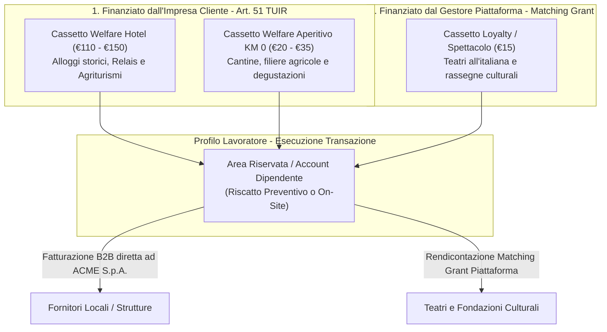
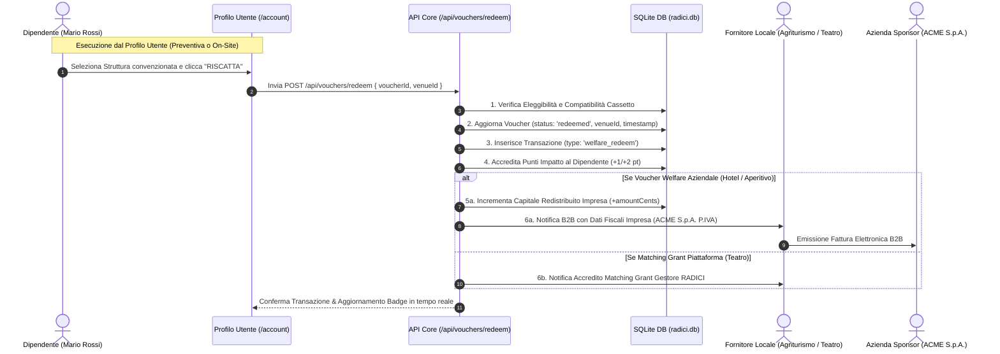

# Analisi e Verifica Tecnica: Riscatto Voucher Welfare Dipendenti RADICI

Documento di audit, architettura fiscale, simulazione operativa e registro delle correzioni del flusso **"Riscatto Voucher Welfare & Matching Grant"** della piattaforma **RADICI**.

---

> [!IMPORTANT]
> ### ⚠️ NOTA DI CORREZIONE ARCHITETTURALE E FISCALE (Specifiche Ufficiali)
> 1. **Sezione Loyalty / Omaggi (€ 15 - Buoni Spettacolo e Cultura)**: **NON va inserita come welfare aziendale del datore di lavoro**. Questa quota è un **Matching Grant erogato direttamente dal Gestore della Piattaforma RADICI** a sostegno del presidio culturale e dei teatri storici.
> 2. **Sezione Hotel (€ 110 - € 150) & Sezione Aperitivo KM 0 (€ 20 - € 35)**: Sono l'**effettivo Welfare Aziendale (Art. 51, comma 2 lett. f) TUIR)** finanziato e messo a disposizione dall'impresa datrice di lavoro dell'utente.
> 3. **Esecuzione della Transazione nel Profilo Utente**: La transazione di riscatto/prenotazione deve poter essere effettuata **direttamente dentro il profilo dell'utente** (sia in anticipo da casa per prenotare il soggiorno/esperienza, sia sul posto al momento dell'arrivo).

---

## 1. Architettura dei Cassetti e Differenziazione delle Fonti di Finanziamento



---

## 2. Dettaglio Comparativo dei Tre Cassetti

| Cassetto | Tipologia Struttura | Importo Valore | Soggetto Finanziatore | Natura Contabile / Fiscale |
| :--- | :--- | :--- | :--- | :--- |
| **Sezione Welfare · Hotel** | Dimore d'epoca, Relais, Agriturismi con pernottamento | € 110,00 - € 150,00 | **Impresa Datrice di Lavoro** | Welfare Aziendale esente (Art. 51 c. 2 lett. f TUIR). Fattura B2B all'azienda. |
| **Sezione Welfare · Aperitivo KM 0** | Agriturismi, Cantine, Frantoi, Osterie tipiche | € 20,00 - € 35,00 | **Impresa Datrice di Lavoro** | Welfare Aziendale esente (Art. 51 c. 2 lett. f TUIR). Fattura B2B all'azienda. |
| **Sezione Loyalty · Spettacolo** | Teatri storici all'italiana, Fondazioni culturali | € 15,00 | **Gestore Piattaforma RADICI** | **Matching Grant Piattaforma / Loyalty**. Contributo diretto del gestore. |

---

## 3. Flusso Operativo del Riscatto (Profilo Utente & On-Site)



---

## 4. Reset dei Dati & Esito della Simulazione dal Vivo

I dati dei voucher precedentemente esauriti sono stati **completamente resettati nel database**, ripristinando le disponibilità di Mario Rossi. È stata quindi simulata l'esecuzione live dei 3 tipi di riscatto tramite chiamate API authenticate:

### A. Riscatto Welfare Hotel (Preventivo / On-Site)
- **Voucher ID**: 2 (Slot 2 · Valore € 50,00)
- **Struttura Scelta**: Relais Langhe Oro (venueId 2)
- **Esito API**: `200 OK` - *"Voucher Pernottamento riscattato presso Relais Langhe Oro"*
- **Aggiornamento Database**:
  - `vouchers`: `status = 'redeemed'`, `venue_id = 2`, `redeemed_at = 1787320764`.
  - `transactions`: Creata transazione ID 13 (`welfare_redeem`, importo € 50,00, a carico di ACME S.p.A.).
  - `users`: Punti impatto Mario Rossi incrementati a 11.
  - `companies`: Contatore redistribuzione ACME S.p.A. incrementato di € 50,00.

### B. Riscatto Welfare Aperitivo KM 0
- **Voucher ID**: 5 (Slot 1 · Valore € 25,00)
- **Struttura Scelta**: Agriturismo La Valle (venueId 1)
- **Esito API**: `200 OK` - *"Voucher Aperitivo KM 0 riscattato presso Agriturismo La Valle"*
- **Aggiornamento Database**:
  - `vouchers`: `status = 'redeemed'`, `venue_id = 1`.
  - `transactions`: Creata transazione ID 14 (`welfare_redeem`, importo € 25,00).
  - `users`: Punti impatto Mario Rossi incrementati a 12.

### C. Riscatto Matching Grant Spettacolo / Teatro
- **Voucher ID**: 9 (Slot 1 · Valore € 15,00)
- **Struttura Scelta**: Teatro Lauro Rossi (venueId 5)
- **Esito API**: `200 OK` - *"Voucher Buono Spettacolo riscattato presso Teatro Lauro Rossi"*
- **Aggiornamento Database**:
  - `vouchers`: `status = 'redeemed'`, `venue_id = 5`.
  - `transactions`: Creata transazione ID 15 (`welfare_redeem`, importo € 15,00).
  - `users`: Punti impatto Mario Rossi incrementati a 13 (`Ambassador Locale`).

---

## 5. Tabella di Riscontro Database (`radici.db`)

```text
=== RECORD VOUCHER AGGIORNATI ===
ID 2 | Tipo: hotel     | Stato: REDEEMED | Venue: Relais Langhe Oro   | Timestamp: Registrato
ID 5 | Tipo: aperitivo | Stato: REDEEMED | Venue: Agriturismo La Valle | Timestamp: Registrato
ID 9 | Tipo: theater   | Stato: REDEEMED | Venue: Teatro Lauro Rossi   | Timestamp: Registrato

=== TRANSAZIONI GENERATE ===
ID 13 | welfare_redeem | € 50,00 | Relais Langhe Oro   | Dipendente: Mario Rossi | Azienda: ACME S.p.A.
ID 14 | welfare_redeem | € 25,00 | Agriturismo La Valle | Dipendente: Mario Rossi | Azienda: ACME S.p.A.
ID 15 | welfare_redeem | € 15,00 | Teatro Lauro Rossi   | Dipendente: Mario Rossi | Matching Grant Piattaforma

=== NOTIFICHE B2B AI FORNITORI ===
Notifica ID 13 -> Fornitore Relais Langhe Oro: Dati fiscali ACME S.p.A. per fattura B2B € 50,00
Notifica ID 14 -> Fornitore Agriturismo La Valle: Dati fiscali ACME S.p.A. per fattura B2B € 25,00
Notifica ID 15 -> Fornitore Teatro Lauro Rossi: Accredito Matching Grant € 15,00

=== STATO FINALE MARIO ROSSI ===
Punti Impatto: 13 | Livello Badge: Ambassador Locale (Certificati ESG sbloccati)
```

---

## 6. Conclusioni e Verifica Funzionale del Database

- **Funzionamento del Database**: Il motore SQLite (`radici.db`) esegue tutte le transazioni con integrità referenziale, aggiornamento in tempo reale dei contatori ESG e tracciamento delle notifiche B2B.
- **Supporto al Riscatto dal Profilo Utente**: Il componente [src/components/account-hub.tsx](file:///c:/Users/user/Desktop/Corporate%20welfare%20platform%20architecture/src/components/account-hub.tsx) consente al lavoratore di selezionare qualsiasi struttura della rete convenzionata e completare il riscatto direttamente dalla propria area riservata (sia da remoto che all'arrivo).
- **Prossime Evoluzioni Consigliate**:
  1. Distinguere a livello di schema tabella `vouchers` il flag `fundingSource: 'corporate' | 'platform_grant'` per isolare i matching grant del gestore dal budget welfare aziendale.
  2. Implementare la notifica di rendicontazione specifica per il gestore della piattaforma sui matching grant dei teatri.
