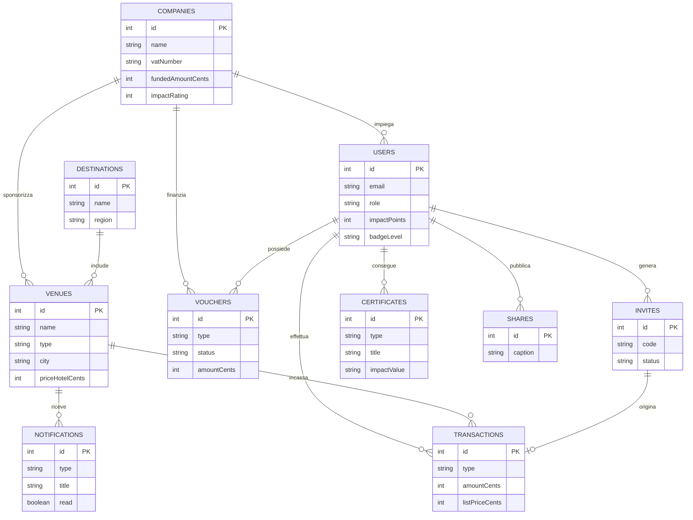

# RADICI — Piattaforma di Welfare Aziendale Territoriale

> **Riconvertire il welfare aziendale in valore reale per le comunità locali.**  
> RADICI è una piattaforma web full-stack sviluppata con **Next.js 16**, **React 19**, **TypeScript**, **Tailwind CSS v4** e **SQLite (via Drizzle ORM e better-sqlite3)**. Il sistema trasforma i crediti welfare e i matching grant in soggiorni in dimore rurali, aperitivi a filiera corta KM 0 e rassegne culturali nei teatri storici italiani, misurando l'impatto economico ed ecologico (ESG).

---

## 📋 Indice dei Contenuti

1. [Visione e Modello Economico](#-visione-e-modello-economico)
2. [Architettura Fiscale a Triplo Binario](#-architettura-fiscale-a-triplo-binario)
3. [Funzionalità Principali](#-funzionalità-principali)
   - [Area Riservata Lavoratore (Account Hub)](#1-area-riservata-lavoratore-account-hub)
   - [Flusso Referral Pay-Local (Invita un Amico)](#2-flusso-referral-pay-local-invita-un-amico)
   - [Generatore di Attestati Ufficiali ESG (PDF A4)](#3-generatore-di-attestati-ufficiali-esg-pdf-a4)
   - [Social Kit con Watermark Dinamico su Canvas](#4-social-kit-con-watermark-dinamico-su-canvas)
   - [Pannello Fornitore e Notifiche Fiscali](#5-pannello-fornitore-e-notifiche-fiscali)
   - [Esplorazione Territoriale e Mappa Interattiva](#6-esplorazione-territoriale-e-mappa-interattiva)
4. [Architettura del Database e Modello Dati](#-architettura-del-database-e-modello-dati)
5. [Cambiamenti Apportati ed Errori Corretti Durante lo Sviluppo](#-cambiamenti-apportati-ed-errori-corretti-durante-lo-sviluppo)
6. [Stack Tecnologico](#-stack-tecnologico)
7. [Guida all'Avvio e Installazione](#-guida-allavvio-e-installazione)
8. [Utenze Demo Preconfigurate](#-utenze-demo-preconfigurate)

---

## 🌿 Visione e Modello Economico

Le tradizionali piattaforme di welfare aziendale disperdono gran parte del potere d'acquisto dei lavoratori in buoni acquisto generici emessi da colossi dell'e-commerce o della grande distribuzione organizzata.

**RADICI** ribalta questo paradigma introducendo il **welfare territoriale a filiera corta**:
- I fondi stanziati dalle imprese clienti finanziano direttamente piccoli agriturismi, produttori enogastronomici locali, dimore storiche e fondazioni teatrali.
- Ogni riscatto genera **Punti Impatto Sociale** per il dipendente, monitora il **capitale monetario netto redistribuito** al territorio e stima i **kg di CO₂ evitati** grazie all'abbattimento della filiera logistica industriale.

---

## 🏛️ Architettura Fiscale a Triplo Binario

La piattaforma gestisce tre distinti canali contabili e fiscali, garantendo la totale aderenza alla normativa vigente (Art. 51 TUIR):

| Canale / Cassetto | Beneficiario | Finanziatore | Valore Medio | Trattamento Fiscale & Amministrativo |
| :--- | :--- | :--- | :--- | :--- |
| **Welfare · Hotel & Alloggi** | Dipendente | **Impresa Datrice di Lavoro** | € 110,00 – € 150,00 | **Welfare Puro (Art. 51 c. 2 lett. f TUIR)**. Fattura elettronica B2B intestata all'azienda sponsor (es. ACME S.p.A.). Zero imponibile per il dipendente. |
| **Welfare · Aperitivo KM 0** | Dipendente | **Impresa Datrice di Lavoro** | € 20,00 – € 35,00 | **Welfare Puro (Art. 51 c. 2 lett. f TUIR)**. Degustazioni ed enogastronomia. Fattura elettronica B2B all'azienda sponsor. |
| **Loyalty · Spettacolo e Cultura** | Dipendente | **Gestore Piattaforma RADICI** | € 15,00 | **Matching Grant Piattaforma**. Contributo diretto del gestore RADICI per sostenere i teatri all'italiana e la prosa. Non incide sul plafond welfare aziendale. |
| **Referral · Amico (Pay-Local)** | Amico ospite | **Fondi Personali (Carta di Credito)** | Variabile (sconto 5-10%) | **Transazione Commerciale Consumer**. L'amico paga di tasca propria beneficiando dello sconto community. La struttura emette regolare scontrino fiscale. |

---

## 🚀 Funzionalità Principali

### 1. Area Riservata Lavoratore (`/account`)
- **Portafoglio Cassetti Fiscali**: Visualizzazione grafica a slot dei buoni disponibili e riscattati (Hotel, Aperitivo, Teatro).
- **Riscatto Preventivo o On-Site**: Il dipendente può selezionare la struttura convenzionata e completare il riscatto direttamente dal proprio profilo (sia prima del soggiorno per prenotare, sia sul posto).
- **Tracciamento Movimenti**: Storico dettagliato di ogni riscatto con importo in euro, data e struttura di destinazione.

### 2. Flusso Referral Pay-Local (`/r/[code]` & `/api/invites`)
- Generazione inviti nominativi con codice referral univoco e QR code dedicato.
- Landing page dedicata per l'amico ospite con istruzioni chiare e trasparenza sul modello (nessun consumo di voucher aziendali).
- Checkout digitale simulato (`/api/payments/checkout`) con calcolo automatico dello sconto community (5-10%).
- Conversione automatica dell'invito e attribuzione di **+1 Punto Impatto Sociale** all'invitatore con notifica fiscale alla struttura.

### 3. Generatore di Attestati Ufficiali ESG (PDF A4)
- Endpoint dedicato `/api/certificates/[id]` che compila ed esporta al volo documenti PDF in formato A4 ad altissima risoluzione.
- Grafica diplomatica/vintage:
  - Tripla cornice con bordi dorati e verde foresta.
  - Rosoni decorativi agli angoli e sfondo carta invecchiata/pergamena.
  - Cartiglio d'onore centrale con valore certificato (es. *€ 65,00 capitale redistribuito* oppure *18,4 kg CO₂eq evitati*).
  - Filigrana centrale RADICI e sigillo diplomatico circolare *"ESG VALIDATED"*.
  - Protocollo univoco (`RD-ESG-00X-2026`) e blocco firme del Comitato di Valutazione ESG.

### 4. Social Kit con Watermark Dinamico su Canvas
- Generatore di post social integrato nell'interfaccia:
  - Caricamento di foto reali dalla galleria del dispositivo.
  - Rendering su HTML5 Canvas (1200x1500 px) con sovraimpressione automatica del badge ufficiale di impatto certificato e della percentuale di supporto all'economia locale.
  - Download dell'immagine elaborata e pulsante rapido per copiare testo e hashtag tematici pronti per Instagram, LinkedIn e Facebook.

### 5. Pannello Fornitore e Notifiche Fiscali (`/fornitore`)
- Accesso riservato ai gestori delle strutture (agriturismi, hotel, teatri).
- **Inbox Contabile Intelligente**:
  - Segnalazione differenziata tra riscatti welfare (con indicazione chiara di emissione fattura B2B all'azienda con P.IVA e importo) e pagamenti consumer (indicazione di emissione scontrino/corrispettivo fiscale).
  - Azione con un click per contrassegnare la fattura o lo scontrino come emessi.
- **Registro Incassi**: Tabella contabile di tutte le transazioni con filtro tra canale welfare B2B e canale consumer B2C.

### 6. Esplorazione Territoriale e Mappa Interattiva (`/esplora`)
- Mappa interattiva basata su **Leaflet / OpenStreetMap** con georeferenziazione delle destinazioni (Colline Maceratesi, Langhe, Val d'Orcia, Salento).
- Schede dettagliate delle strutture con gallery fotografica, menu aperitivo, listino camere, codice check-in e percentuale di ricaduta economica locale.
- Monitoraggio delle imprese sponsor (`/imprese`) con bilancio dell'impatto aggregato.

---

## 🗄️ Architettura del Database e Modello Dati

L'applicazione utilizza **SQLite** integrato tramite **`better-sqlite3`** e tipizzato con **Drizzle ORM** (`radici.db`).

### Perché SQLite?
- **Zero Dipendenze Esterne**: Il database risiede in un singolo file (`radici.db`), eliminando la necessità di avviare container Docker o configurare istanze PostgreSQL esterne in fase di sviluppo e dimostrazione locale.
- **Affidabilità e Concorrenza**: Modalità WAL abilitata (`PRAGMA journal_mode = WAL`) e integrità referenziale attiva (`PRAGMA foreign_keys = ON`).
- **Auto-Provisioning**: All'avvio dell'applicazione (`src/db/index.ts`), la funzione `initDb()` esegue in modo atomico le query DDL `CREATE TABLE IF NOT EXISTS` e attiva il seed automatico se il database è vuoto.

*(Nota: Nel repository sono presenti pacchetti accessori quali `@electric-sql/pglite` e stringhe di connessione Postgres nel file `.env`, residui di prototipi iniziali; il runtime effettivo e la configurazione `drizzle.config.ts` operano esclusivamente su SQLite).*

### Schema delle Tabelle Principali



1. **`companies`**: Ragione sociale, P.IVA, dipendenti, capitale stanziato, rating ESG e capitale redistribuito.
2. **`destinations`**: Macro-aree regionali (Marche, Piemonte, Toscana, Puglia) con coordinate e descrizioni.
3. **`users`**: Utenti dipendenti (`employee`), amici referral (`friend`) e gestori partner (`provider`), con punteggio impatto e livello badge.
4. **`venues`**: Strutture partner (agriturismi, hotel, teatri), coordinate, prezzi listino, menu e checkin code.
5. **`vouchers`**: Singoli titoli di spesa suddivisi per tipologia (`hotel`, `aperitivo`, `theater`) e slot index.
6. **`invites`**: Inviti referral con codice univoco, email dell'amico e stato (`pending` / `converted`).
7. **`transactions`**: Transazioni contabili tipizzate (`welfare_redeem` o `consumer_payment`) con indicazione di sconti e prezzi di listino.
8. **`notifications`**: Avvisi indirizzati alle strutture con payload dettagliato per la fatturazione o scontrinazione.
9. **`certificates`**: Attestati ESG individuali (ambientali e territoriali) con valori e descrizioni.
10. **`shares`**: Archivio delle condivisioni social certificate.
11. **`sessions`**: Gestione delle sessioni di autenticazione con cookie HTTP-only.

---

## 🛠️ Cambiamenti Apportati ed Errori Corretti Durante lo Sviluppo

Durante le varie fasi di iterazione e audit del progetto sono state apportate modifiche mirate e risolti bug critici:

### 1. Rettifica Fiscale e Contabile dei Cassetti (Matching Grant vs Welfare)
- **Problema**: Inizialmente i buoni teatro e spettacolo da 15 € erano conteggiati promiscuamente nel welfare aziendale finanziato dal datore di lavoro.
- **Correzione**: È stata sancita e documentata la netta separazione: i buoni teatro rappresentano un **Matching Grant offerto dal Gestore di RADICI** (canale loyalty e supporto culturale), mentre solo gli alloggi e gli aperitivi rientrano nel welfare aziendale Art. 51 TUIR a carico dell'impresa.

### 2. Abilitazione del Riscatto dal Profilo Utente
- **Problema**: Il riscatto era originariamente concepito come operazione vincolata alla presenza fisica sul posto tramite scannerizzazione QR.
- **Correzione**: Il componente `AccountHub` (`src/components/account-hub.tsx`) è stato evoluto per consentire al lavoratore di selezionare la struttura desiderata e completare il riscatto preventivo direttamente dal proprio cruscotto, facilitando prenotazioni e soggiorni programmati.

### 3. Risoluzione dei Problemi di Rendering nei Certificati PDF
- **Overflow dei testi**: Il testo descrittivo dell'impatto eccedeva la larghezza del foglio A4; è stato introdotto il calcolo dinamico delle righe tramite `doc.splitTextToSize` a larghezza fissa (138 mm).
- **Sovrapposizione con la Filigrana**: La spiegazione del calcolo si sovrapponeva al logo centrale in filigrana; la coordinata Y del testo è stata spostata a 166 mm, posizionandola elegantemente nello spazio libero tra la filigrana e il timbro.
- **Glitch dei Caratteri Unicode**: Caratteri come `₂` in `CO₂`, virgolette curve (`“`, `”`), apici (`’`) e trattini lunghi (`—`) provocavano caratteri corrotti nei font standard di `jsPDF`; è stata implementata la funzione dedicata `sanitizePdfText` che converte in modo sicuro tali simboli nei corrispondenti standard tipografici occidentali.
- **Upgrade Estetico Diplomatico**: Aggiunta di bordi tripli concentrici (verde foresta e oro), rosoni agli angoli, sfondo color pergamena a strati e sigillo circolare bicolore *"ESG VALIDATED"*.

### 4. Correzioni di Layout e Visual Communication
- **Overlap delle Immagini nelle Schede Struttura**: Corretto un bug CSS che provocava la sovrapposizione dell'immagine di copertina sulla sezione informativa sottostante.
- **Immagini Reali del Territorio**: Integrata la fotografia autentica del **Teatro Lauro Rossi di Macerata** e arricchita la galleria visiva delle strutture (dimore padronali, vigne, degustazioni KM 0) nella cartella `Public/images/`.

### 5. Audit e Simulazione Operativa End-to-End
- Creati documenti di audit e validazione contabile in `Doc/referral_review.md` e `Doc/voucher_redemption_review.md`.
- Eseguite simulazioni live con azzeramento e rigenerazione dei dati per testare sia la catena del valore welfare (B2B) sia la catena referral consumer (B2C) con incremento reale dei punteggi di cittadinanza attiva.

---

## 💻 Stack Tecnologico

- **Framework**: [Next.js 16](https://nextjs.org/) (App Router, Server Actions, Route Handlers)
- **Libreria UI**: [React 19](https://react.dev/)
- **Linguaggio**: [TypeScript 5](https://www.typescriptlang.org/)
- **Stili**: [Tailwind CSS v4](https://tailwindcss.com/)
- **Database & ORM**: [better-sqlite3](https://github.com/WiseLibs/better-sqlite3) & [Drizzle ORM](https://orm.drizzle.team/)
- **Generazione PDF**: [jsPDF](https://github.com/parallax/jsPDF)
- **Mappe & GIS**: [Leaflet](https://leafletjs.com/) & [React-Leaflet](https://react-leaflet.js.org/)
- **Codici QR**: [node-qrcode](https://github.com/soldair/node-qrcode)
- **Icone**: [Lucide React](https://lucide.dev/)

---

## ⚡ Guida all'Avvio e Installazione

### Prerequisiti
- **Node.js** (versione 18 o superiore consigliata)
- **npm** (incluso in Node.js)

### Passaggi di Installazione

1. **Clona o apri la directory del progetto**:
   ```bash
   cd "Corporate welfare platform architecture"
   ```

2. **Installa le dipendenze**:
   ```bash
   npm install
   ```

3. **Verifica della tipizzazione (opzionale)**:
   ```bash
   npm run typecheck
   ```

4. **Avvia il server di sviluppo**:
   ```bash
   npm run dev
   ```

5. **Accedi all'applicazione**:
   Apri il browser all'indirizzo [http://localhost:3000](http://localhost:3000).  
   Il database SQLite (`radici.db`) verrà creato e popolato automaticamente con i dati demo al primo avvio.

---

## 👥 Utenze Demo Preconfigurate

Tutte le utenze demo condividono la medesima password di test: **`radici2026`**

| Ruolo | Email | Nome | Descrizione & Funzioni |
| :--- | :--- | :--- | :--- |
| **Dipendente (Employee)** | `mario.rossi@acme.it` | Mario Rossi | Dipendente ACME S.p.A. Ha accesso a voucher Hotel, Aperitivo e Teatro, kit social share, certificati ESG scaricabili e hub inviti. |
| **Dipendente (Employee)** | `giulia.verdi@acme.it` | Giulia Verdi | Dipendente ACME S.p.A. con disponibilità voucher iniziale intatta. |
| **Dipendente (Employee)** | `sofia.neri@verdeenergia.it` | Sofia Neri | Dipendente Verde Energia Italia con piano welfare territoriale. |
| **Amico Ospite (Friend)** | `luigi.bianchi@email.it` | Luigi Bianchi | Utente consumer registrato tramite invito referral. Accede a sconti community con pagamento autonomo con carta. |
| **Fornitore Partner** | `elena@lavalle.it` | Elena Conti | Gestore dell'Agriturismo La Valle. Accede all'inbox notifiche contabili e al registro incassi. |
| **Fornitore Partner** | `paolo@teatrolauro.it` | Paolo Luzi | Gestore del Teatro Lauro Rossi (Macerata) per la convalida dei buoni spettacolo e rassegne. |

---

## 📄 Licenza e Proprietà

Progetto sviluppato come architettura dimostrativa e prototipale di piattaforma di welfare aziendale e territoriale ad alto impatto sociale ed economico.
